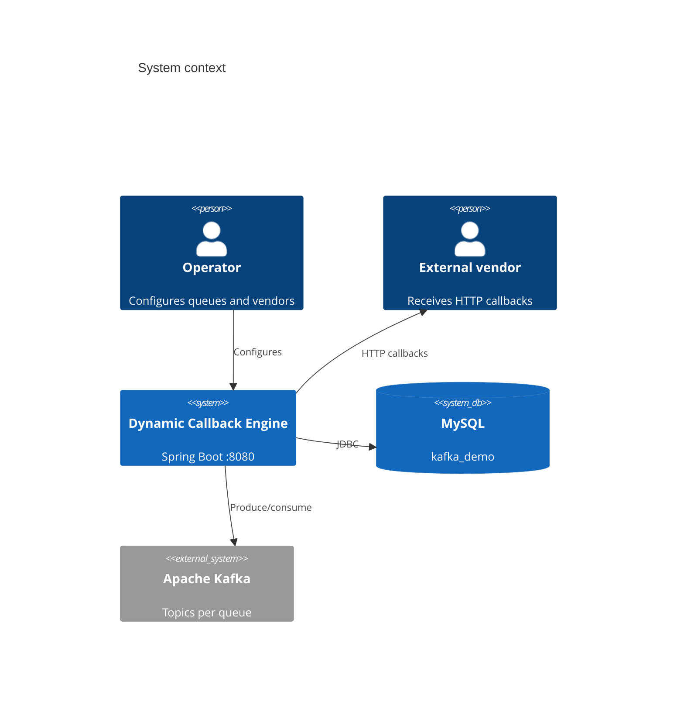
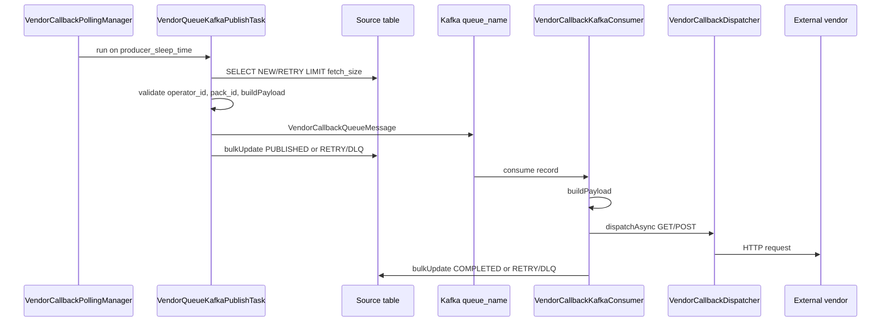
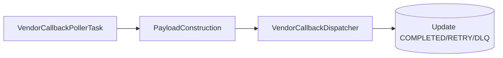
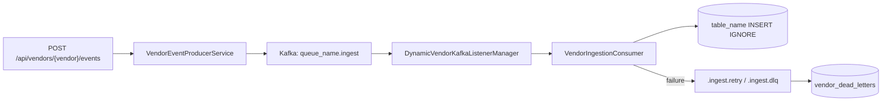
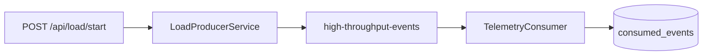
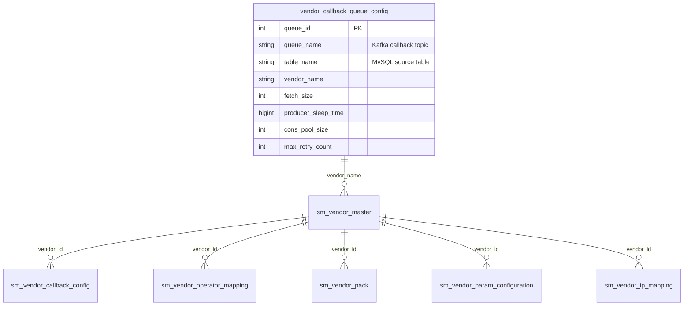
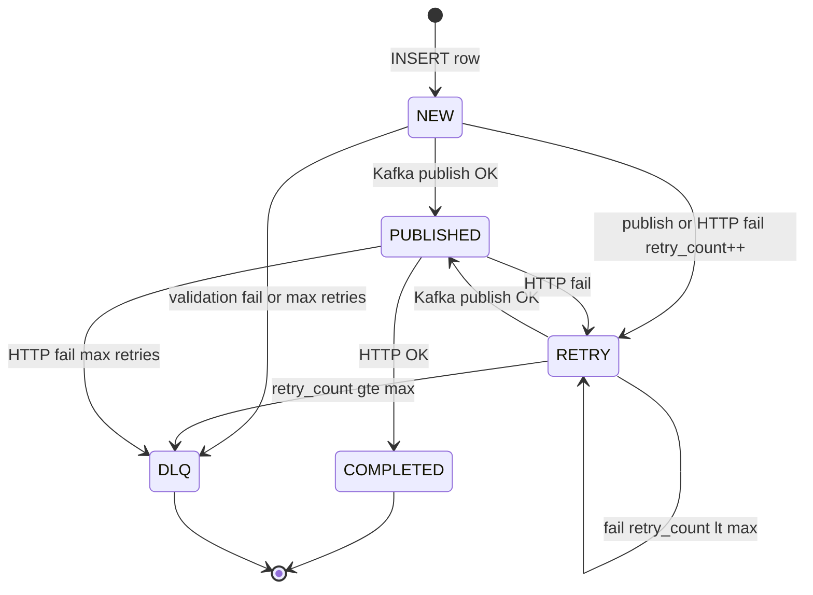
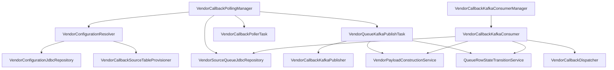

# Architecture — Dynamic Callback Engine

This document is the maintained technical reference for the `kafka-demo` application. See [README.md](README.md) for setup and operations.

---

## System context



---

## Three subsystems

### A. Vendor callback gateway (primary)

**Goal:** Drain rows from per-vendor MySQL queue tables and invoke configured HTTP callbacks with validated, schema-driven payloads.

**Config sources:**

- `vendor_callback_queue_config` — operational knobs and pointers (`table_name`, `queue_name`)
- `sm_vendor_*` — business rules (URL, params, operators, packs)

**Entry point:** `VendorCallbackPollingManager` schedules one task per active, fully resolved queue.

#### Mode 1: Kafka dispatch (default)

`app.vendor-callback.dispatch-via-kafka: true`



| Step | Class | Responsibility |
|------|--------|----------------|
| 1 | `VendorConfigurationResolver` | JOIN config tables → `ResolvedVendorConfiguration` cache |
| 2 | `VendorCallbackSourceTableProvisioner` | `CREATE TABLE` if missing (standard columns + param fields) |
| 3 | `VendorSourceQueueJdbcRepository.pollUnprocessedRows` | `WHERE process_status IN ('NEW','RETRY')` |
| 4 | `VendorPayloadConstructionService` | Validate routing; map columns to JSON |
| 5 | `VendorCallbackKafkaPublisher` | Async publish to `queue_name` |
| 6 | `QueueRowStateTransitionService` | `PUBLISHED` on Kafka ACK; retry/DLQ on failure |
| 7 | `VendorCallbackKafkaConsumerManager` | One listener container per `queue_name` |
| 8 | `VendorCallbackKafkaConsumer` | Consume → HTTP → final state update |

#### Mode 2: Direct HTTP

`app.vendor-callback.dispatch-via-kafka: false`

Same poll/validate path, but `VendorCallbackPollerTask` calls `VendorCallbackDispatcher` directly (no `PUBLISHED` state).



---

### B. Vendor REST/Kafka ingestion

**Goal:** Accept events via REST, publish to Kafka, validate, and insert into the queue's `table_name`.



| Component | Role |
|-----------|------|
| `VendorEventController` | REST API |
| `VendorTopicNames` | Topic naming: ingestion uses `.ingest` suffix |
| `VendorEventProducerService` | Publish `VendorEvent` to ingest topic |
| `DynamicVendorKafkaListenerManager` | Per-queue containers; `cons_pool_size`, `fetch_size` from config |
| `VendorIngestionConsumer` | Validate, save, retry/DLQ via `VendorFailurePublisher` |
| `VendorEventJdbcRepository` | Dynamic column-matched INSERT |

---

### C. Kafka load-test demo

**Goal:** Stress-test Kafka → MySQL write throughput.



---

## Configuration resolution (callback)



**Resolver SQL** (`VendorConfigurationJdbcRepository`): inner join active queue + active vendor + non-empty callback URL + at least one active pack. Circle matching applies when `vendor_circle_flag = 1`.

---

## State machine (source queue rows)



Direct HTTP mode skips `PUBLISHED`.

---

## Threading model

| Pool / thread prefix | Used by |
|----------------------|---------|
| `vendor-callback-poller-*` | `ThreadPoolTaskScheduler` — one delayed task per queue |
| `vendor-callback-http-*` | `vendorCallbackDispatchExecutor` — Kafka publish + async HTTP |
| Kafka consumer threads | `VendorCallbackKafkaConsumerManager`, `DynamicVendorKafkaListenerManager` |
| `producer-pool-*` | `LoadProducerService` |
| Telemetry listener pool | `app.kafka.consumer-concurrency` |

Batch pattern: poll N rows → N async operations → `CompletableFuture.allOf()` → single `bulkUpdateRowStates`.

---

## Startup and refresh lifecycle

```mermaid
flowchart TD
  A[Spring Boot start] --> B[schema.sql]
  B --> C[VendorConfigurationResolver.refresh]
  C --> D[VendorCallbackPollingManager.start]
  D --> E[Schedule poll tasks]
  C --> F[VendorCallbackKafkaConsumerManager.start]
  G[DynamicVendorKafkaListenerManager.start]
  H[TelemetryConsumer registers]
  I[@Scheduled config-refresh-ms] --> C
  I --> J[rescheduleAll pollers]
  I --> K[kafkaConsumerManager.restart]
```

---

## Package dependency (callback module)



---

## Seed data (local dev)

From `schema.sql`:

| vendor_name | queue_name | table_name | circle |
|-------------|------------|------------|--------|
| one97 | queue_callback_one97 | vendor_callback_queue_one97_tanzania | tanzania |
| paytmchemba | queue_callback_paytmchemba | vendor_callback_queue_paytmchemba | default |

Demo callback URL: `http://localhost:8080/actuator/health` (GET). Production deployments should point `callback_url` at real vendor endpoints.

---

## Design decisions

1. **`queue_name` vs `table_name`** — Kafka topic uses `queue_name`; all polling and state updates use `table_name`. They are linked by one `vendor_callback_queue_config` row.

2. **Separate ingest topics** — `{queue_name}.ingest` avoids mixing `VendorEvent` JSON with `VendorCallbackQueueMessage` on the same topic.

3. **JdbcTemplate over JPA** — Dynamic tables and column sets per vendor; metadata-driven INSERT and batch UPDATE.

4. **No `_producer` tables** — Removed legacy Kafka callback consumer that cloned rows into `*_producer` tables. State is tracked on the source queue row only.

5. **Config refresh** — Poller intervals and Kafka consumer containers can be rebound without full JVM restart (scheduled refresh).

---

## Extension points

| Change | Touch |
|--------|--------|
| New queue/vendor | DB rows in `vendor_callback_queue_config` + `sm_vendor_*` |
| New payload field | `sm_vendor_param_configuration` + column on source table |
| Custom HTTP headers | Extend `VendorCallbackDispatcher` |
| Metrics/tracing | Wrap dispatcher and publisher; add Micrometer |
| Disable Kafka for callbacks | `app.vendor-callback.dispatch-via-kafka: false` |

See also [PROJECT_STRUCTURE_DIAGRAM.md](PROJECT_STRUCTURE_DIAGRAM.md) for a concise package map.
