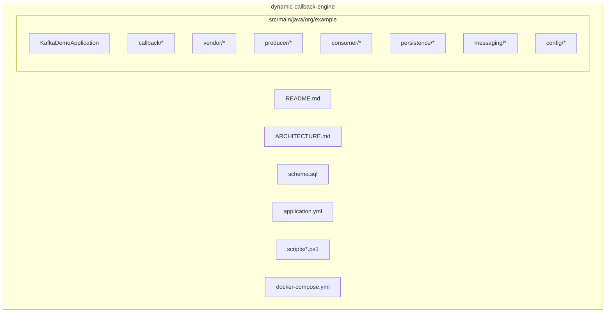

# Project structure diagram

Quick visual map of the repository. For full architecture, see [ARCHITECTURE.md](ARCHITECTURE.md). For runbooks, see [README.md](README.md).



## Callback module (`org.example.callback`)

```text
callback/
├── config/
│   VendorCallbackProperties.java      # app.vendor-callback.*
│   VendorCallbackRestTemplateConfig.java
├── dto/
│   ResolvedVendorConfiguration.java   # In-memory routing rule
│   ProcessStatus.java                 # NEW, RETRY, PUBLISHED, COMPLETED, DLQ
│   DispatchResult.java
│   QueueRowStateUpdate.java
├── repository/
│   VendorConfigurationJdbcRepository.java    # sm_vendor JOIN queue config
│   VendorSourceQueueJdbcRepository.java      # Poll + bulk UPDATE
│   VendorCallbackSourceTableProvisioner.java # DDL for table_name
├── service/
│   VendorConfigurationResolver.java
│   VendorPayloadConstructionService.java
│   VendorCallbackDispatcher.java
│   VendorCallbackKafkaPublisher.java
│   QueueRowStateTransitionService.java
├── poller/
│   VendorCallbackPollingManager.java
│   VendorQueueKafkaPublishTask.java    # Kafka mode
│   VendorCallbackPollerTask.java       # Direct HTTP mode
├── consumer/
│   VendorCallbackKafkaConsumer.java
└── kafka/
    VendorCallbackKafkaConsumerManager.java
```

## Supporting modules

```text
persistence/          # Shared JDBC layer
  VendorCallbackQueueConfigRepository.java
  VendorCallbackQueueConfig.java
  VendorEventJdbcRepository.java
  ConsumedEventJdbcRepository.java
  DeadLetterJdbcRepository.java
  SqlIdentifier.java

vendor/               # REST ingestion + Kafka listeners
  VendorEventController.java
  VendorEventProducerService.java
  DynamicVendorKafkaListenerManager.java
  VendorIngestionConsumer.java  (in consumer/)
  VendorTopicNames.java

producer/             # Load test API
  LoadController.java
  LoadProducerService.java

consumer/
  TelemetryConsumer.java
  VendorIngestionConsumer.java

messaging/
  VendorCallbackQueueMessage.java   # Callback Kafka payload
  VendorEvent.java                  # Ingestion payload
  TelemetryEvent.java               # Load test payload
  DeadLetterEvent.java
```

## Data flow by folder

| Folder | Reads | Writes |
|--------|-------|--------|
| `callback.repository` | Source tables, config JOIN | Source table status |
| `callback.service` | Config cache | — |
| `callback.poller` | Source tables | Kafka + status |
| `callback.consumer` | Kafka | HTTP + status |
| `vendor` + `consumer` | Kafka ingest | `table_name` |
| `producer` + `consumer` | — | Kafka / `consumed_events` |
