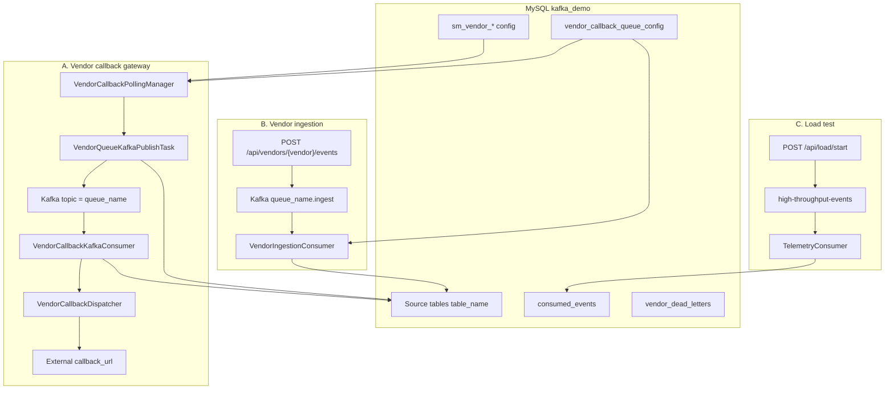

# Dynamic Callback Engine

Spring Boot application (`kafka-demo`) that combines three capabilities in one service:

1. **Vendor callback gateway** — Poll config-driven MySQL queue tables and dispatch HTTP callbacks to external vendors (optionally via Kafka).
2. **Vendor REST/Kafka ingestion** — Accept vendor events over HTTP, publish to Kafka, and persist into the configured source table.
3. **Kafka load-test demo** — Generate high-volume telemetry traffic and batch-write to MySQL.

**Main class:** `org.example.KafkaDemoApplication`  
**Stack:** Java 8, Spring Boot 2.7.x, Spring JDBC, Spring Kafka, MySQL, RestTemplate  
**Database:** `kafka_demo` on MySQL (`localhost:3306`)  
**HTTP port:** `8080`  
**Kafka:** `localhost:9092`

For architecture diagrams and package-level detail, see [ARCHITECTURE.md](ARCHITECTURE.md) and [PROJECT_STRUCTURE_DIAGRAM.md](PROJECT_STRUCTURE_DIAGRAM.md).

---

## Architecture overview



**Callback path (default):** `dispatch-via-kafka: true` — poll `NEW`/`RETRY` rows → publish `VendorCallbackQueueMessage` to `queue_name` → consumer builds payload → HTTP GET/POST → update `process_status`.

**Direct HTTP path:** set `app.vendor-callback.dispatch-via-kafka: false` to skip Kafka and call vendors from the poller thread.

---

## Prerequisites

- Java 8
- Maven (or IntelliJ bundled Maven via `scripts/run-app.ps1`)
- MySQL 8.x with database `kafka_demo`
- Apache Kafka 3.x on `localhost:9092`

### Docker (optional)

```powershell
docker compose up -d
```

### Manual MySQL

```sql
CREATE DATABASE IF NOT EXISTS kafka_demo;
```

On startup, `src/main/resources/schema.sql` runs automatically (`spring.sql.init.mode: always`).

---

## Run the application

```powershell
cd e:\dynamic-callback-engine
.\scripts\run-app.ps1
```

Custom MySQL password:

```powershell
.\scripts\run-app.ps1 -MysqlUser root -MysqlPassword "your-password"
```

Or:

```powershell
mvn spring-boot:run
```

---

## Configuration

Key settings in `src/main/resources/application.yml`:

| Property | Default | Description |
|----------|---------|-------------|
| `app.vendor-callback.enabled` | `true` | Master switch for callback engine |
| `app.vendor-callback.dispatch-via-kafka` | `true` | Kafka pipeline vs direct HTTP from poller |
| `app.vendor-callback.config-refresh-ms` | `60000` | Reload DB config and reschedule pollers |
| `app.vendor-callback.scheduler-pool-size` | `20` | Threads for scheduled poll tasks |
| `spring.kafka.bootstrap-servers` | `localhost:9092` | Kafka broker |
| `app.kafka.topic` | `high-throughput-events` | Load-test topic |

Queue-specific settings come from **`vendor_callback_queue_config`** (not hardcoded in YAML): `table_name`, `queue_name`, `fetch_size`, `producer_sleep_time`, `cons_pool_size`, `max_retry_count`, `vendor_name`, `circle_name`.

---

## Database model (summary)

| Table / group | Role |
|---------------|------|
| `vendor_callback_queue_config` | Registry: `queue_name` (Kafka topic), `table_name` (source table), polling & consumer tuning |
| `sm_vendor_master`, `sm_vendor_operator_mapping`, `sm_vendor_pack` | Vendor activation and routing rules |
| `sm_vendor_param_configuration` | Map source columns → HTTP payload fields |
| `sm_vendor_callback_config` | `callback_url`, `http_method`, circle |
| `sm_vendor_ip_mapping` | Optional IP allow-list |
| `vendor_callback_queue_*` | Per-queue source tables with `id`, `process_status`, `retry_count`, business columns |
| `consumed_events` | Load-test consumer storage |
| `vendor_dead_letters` | Ingestion failure archive |

### Row states (`process_status`)

| Status | Meaning |
|--------|---------|
| `NEW` | Ready to poll |
| `RETRY` | Failed; eligible for repoll if under max retries |
| `PUBLISHED` | Sent to Kafka (Kafka dispatch mode only) |
| `COMPLETED` | HTTP callback succeeded |
| `DLQ` | Validation failure or max retries exceeded |

---

## Kafka topics

| Topic | Message type | Purpose |
|-------|----------------|---------|
| `{queue_name}` e.g. `queue_callback_one97` | `VendorCallbackQueueMessage` | Callback dispatch |
| `{queue_name}.ingest` | `VendorEvent` | REST ingestion |
| `{queue_name}.ingest.retry` | `VendorEvent` | Ingestion retries |
| `{queue_name}.ingest.dlq` | `DeadLetterEvent` | Ingestion DLQ |
| `high-throughput-events` | `TelemetryEvent` | Load test |

Callback and ingestion use **different topic names** so message formats do not collide.

---

## REST APIs

### Vendor callback / ingestion — `/api/vendors`

Vendor must exist in `vendor_callback_queue_config` (active) with matching `sm_vendor_*` data.

```powershell
# one97 (see schema.sql for field names)
Invoke-RestMethod -Method Post `
  -Uri "http://localhost:8080/api/vendors/one97/events" `
  -ContentType "application/json" `
  -Body '{"event_id":"evt-2","customer_id":"cust-200","amount":"50.00","operator_id":"OP1","pack_id":"PACK1"}'
```

Events are published to `queue_callback_one97.ingest` and, when consumed, inserted into the queue's `table_name`.

### Load test — `/api/load`

```powershell
.\scripts\start-load.ps1 -Producers 50 -MessagesPerProducer 100000 -PayloadBytes 256
.\scripts\check-load.ps1 -JobId "<job-id-from-start>"
```

---

## Adding a new vendor queue

1. **Insert** `vendor_callback_queue_config` (`queue_name`, `table_name`, `vendor_name`, `fetch_size`, `producer_sleep_time`, `cons_pool_size`, `max_retry_count`, `status = 1`).
2. **Configure** `sm_vendor_master` (`isCallback_active = 1`), operators, packs, `sm_vendor_callback_config`, and `sm_vendor_param_configuration` for the vendor/circle.
3. **Create** the source table (or let `VendorCallbackSourceTableProvisioner` create it on config refresh).
4. **Insert** rows with `process_status = 'NEW'`, `operator_id`, `pack_id`, and required business columns.
5. **Restart** or wait for `config-refresh-ms` — pollers and Kafka consumers are rescheduled automatically.

---

## Project structure (active code)

```text
src/main/java/org/example/
├── KafkaDemoApplication.java
├── config/                    # AppProperties, KafkaConfig, ProducerPoolConfig
├── callback/                  # Vendor callback gateway (primary product)
│   ├── config/                # VendorCallbackProperties, RestTemplate, thread pools
│   ├── consumer/              # VendorCallbackKafkaConsumer
│   ├── dto/                   # ResolvedVendorConfiguration, ProcessStatus, ...
│   ├── kafka/                 # VendorCallbackKafkaConsumerManager
│   ├── poller/                # PollingManager, Kafka publish & HTTP tasks
│   ├── repository/            # JDBC: poll, bulk update, config JOIN, DDL provisioner
│   └── service/               # Resolver, payload, dispatcher, state transitions
├── consumer/                  # TelemetryConsumer, VendorIngestionConsumer
├── messaging/                 # TelemetryEvent, VendorEvent, VendorCallbackQueueMessage
├── persistence/               # JdbcTemplate repositories, VendorCallbackQueueConfig
├── producer/                  # LoadController, LoadProducerService
└── vendor/                    # VendorEventController, Kafka listeners, validation, DLQ
```

---

## Tuning notes

- Match Kafka **partitions** to desired parallelism (`app.kafka.partitions`, default 48).
- `app.producer.max-pool-size` — load-test producer pool.
- `app.kafka.consumer-concurrency` — telemetry consumer threads.
- `cons_pool_size` in `vendor_callback_queue_config` — callback and ingestion consumer concurrency per queue.
- `fetch_size` — poll batch size and consumer `max.poll.records`.
- Use `INSERT IGNORE` / idempotent keys where applicable so Kafka retries do not corrupt state.

---

## Troubleshooting

| Symptom | Check |
|---------|--------|
| No callback pollers scheduled | `sm_vendor_*` complete for `vendor_name`? Logs: "no resolved routing" |
| Kafka connection errors | Broker on `9092`; `SPRING_KAFKA_BOOTSTRAP_SERVERS` |
| MySQL errors | DB `kafka_demo` exists; credentials match `run-app.ps1` |
| Rows never leave `NEW` | `operator_id` / `pack_id` present? Param config matches columns? |
| HTTP failures → `RETRY`/`DLQ` | `callback_url` reachable; demo uses `/actuator/health` (needs actuator on classpath) |

---

## Related documentation

| Document | Description |
|----------|-------------|
| [ARCHITECTURE.md](ARCHITECTURE.md) | Diagrams, sequences, state machine, design decisions |
| [PROJECT_STRUCTURE_DIAGRAM.md](PROJECT_STRUCTURE_DIAGRAM.md) | Package map and callback module layout |

---

## License / artifact

Maven artifact: `org.example:kafka-demo:1.0-SNAPSHOT`
